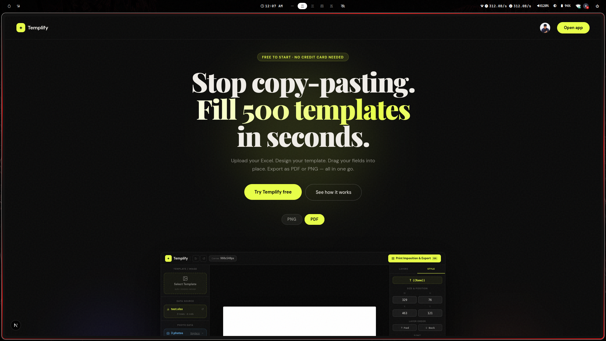
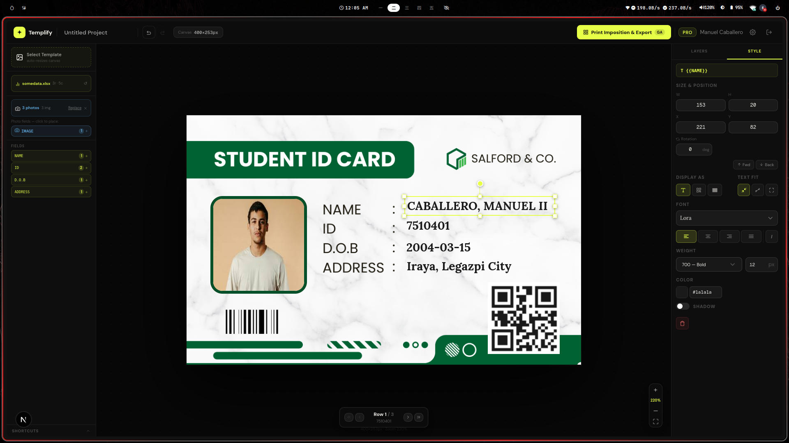
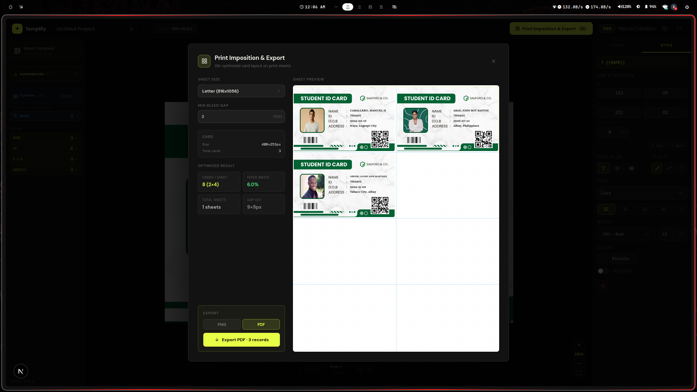

# Templify

**Bulk-fill certificates, ID cards, badges, and invitations from a spreadsheet — no copy-pasting.**

Upload your Excel. Design your template. Drag your fields into place. Export as PNG or PDF — all in one go.

Open the editor and try it free at **`/sandbox`** (no account needed) · [Report a Bug](https://github.com/zorncbllr/templify/issues)

---

## Screenshots

**Landing page** — the product pitch, feature highlights, and how-it-works overview.



**Flexible editor** — upload your Excel, design your template, and drag fields anywhere on the canvas.



**Smart dynamic print impositioning** — press export and Templify automatically handles the layout for batch printing.



---

## The Problem

Manually typing names into a certificate template for 500 students is soul-crushing and time consuming.

**Templify reads your spreadsheet, fills every record into your design, and exports the whole batch in seconds.**

---

## Features

- **Excel / CSV Import** — Drop your spreadsheet and Templify reads every column: names, dates, IDs, anything.
- **Drag-and-Drop Design** — Upload a background image and drag column fields anywhere on the canvas. Style each field freely.
- **Auto Photo Matching** — Upload a folder of photos and Templify matches each one to the right row by filename.
- **Smart Auto-Shrink** — Long names never overflow. Text auto-scales to fit its field, and heavily-shrunk records are flagged in preview.
- **Batch Layout** — Print 1, 2, 4, 6, or 9 records per page for ID cards, badges, and certificates.
- **Bulk Export** — Download as PNG or PDF. Export every record in one click, zipped up.
- **26+ Google Fonts** — Search and preview fonts by category — Serif, Sans, Script, Display, Mono — live on your canvas.
- **Undo / Redo** — Full 25-step history. Every change is reversible.
- **Canvas Styling** — Background color, borders, corner radius, grid overlay, drop shadows, outlines — every detail is yours.
- **Keyboard Shortcuts** — Duplicate, nudge with arrow keys, quick delete. Built for speed.
- **QR & Barcode Support** — Render QR codes and barcodes directly in your templates.
- **Sandbox Mode** — Open the editor without an account to try everything first.

### Use Cases

School certificates · Event badges · ID cards · Scholarship liquidation · Invitations · Award documents · Name tags · Bulk certificates

---

## Tech Stack

| Layer           | Technology                                                                                     |
| --------------- | ---------------------------------------------------------------------------------------------- |
| Framework       | [Next.js 16](https://nextjs.org) (App Router, Turbopack) + React 19                             |
| Language        | TypeScript 5                                                                                   |
| Auth & Database | [Supabase](https://supabase.com) (SSR cookies via `@supabase/ssr`)                            |
| Storage         | [Cloudflare R2](https://developers.cloudflare.com/r2/) (S3-compatible) for user-uploaded images |
| Payments        | [PayMongo](https://paymongo.com) — GCash, Maya, QRPH, Card                                     |
| Styling         | [Tailwind CSS 4](https://tailwindcss.com) + CSS variables                                       |
| UI              | [Radix UI](https://www.radix-ui.com) / [shadcn/ui](https://ui.shadcn.com)                        |
| Export          | Canvas 2D API + jsPDF & JSZip (loaded via CDN at runtime)                                      |

---

## Getting Started

> This project uses **bun**. Please use `bun` — never npm/yarn/pnpm.

### Prerequisites

- [bun](https://bun.sh) ≥ 1.x
- A [Supabase](https://supabase.com) project
- A [Cloudflare R2](https://developers.cloudflare.com/r2/) bucket (optional if you skip image storage)
- A [PayMongo](https://paymongo.com) account (optional if you skip payments)

### Install

```bash
git clone https://github.com/zorncbllr/templify.git
cd templify
bun install
```

### Environment Variables

Copy `.env.local.example` to `.env.local` and fill in your values:

```bash
cp .env.local.example .env.local
```

| Variable                          | Required | Description                                                            |
| --------------------------------- | -------- | ---------------------------------------------------------------------- |
| `NEXT_PUBLIC_SUPABASE_URL`      | Yes      | Supabase project URL                                                   |
| `NEXT_PUBLIC_SUPABASE_ANON_KEY` | Yes      | Supabase public anon key                                               |
| `SUPABASE_SERVICE_ROLE_KEY`     | Yes      | Supabase service-role key (server-side only)                           |
| `PAYMONGO_SECRET_KEY`           | Optional | PayMongo secret key for checkout                                       |
| `PAYMONGO_WEBHOOK_SECRET`       | Optional | PayMongo webhook verification secret                                   |
| `NEXT_PUBLIC_R2_CDN_URL`        | Optional | Cloudflare R2 CDN / public bucket URL                                  |
| `R2_ACCOUNT_ID`                 | Optional | Cloudflare account ID                                                  |
| `R2_ACCESS_KEY`                 | Optional | R2 S3 access key                                                       |
| `R2_SECRET_KEY`                 | Optional | R2 S3 secret key                                                       |
| `NEXT_PUBLIC_APP_URL`           | Yes      | Your app URL (`http://localhost:3000` in dev)                        |
| `CRON_SECRET`                   | Optional | Guard for the plan-renewal cron (generate via`openssl rand -hex 32`) |

### Run

```bash
bun run dev          # start dev server on http://localhost:3000
bun run build        # production build
bun run start        # run the built app
bun run lint         # ESLint
```

### Database Setup

Apply the migrations in `supabase/migrations/` in numeric order:

```bash
supabase db push
```

---

## Project Structure

```
app/
├── (auth)/login/          # Google OAuth sign-in via Supabase
├── (marketing)/pricing/   # Locale-aware pricing page
├── (dashboard)/           # Authenticated app
│   ├── dashboard/         # Project list
│   ├── projects/[id]/edit # Project editor (saved, per-user)
│   ├── settings/          # Account & plan settings
│   └── payment-success/   # Checkout confirmation
├── api/                   # Route handlers
│   ├── checkout/          # Start PayMongo checkout
│   ├── webhook/paymongo/  # Payment webhook
│   ├── verify-payment/    # Verify payment status
│   ├── cancel-subscription/
│   ├── r2/                # upload, list, delete, proxy for data images
│   └── cron/check-plans/  # Daily plan downgrade job
├── sandbox/               # Unauthenticated free-tier editor
└── auth/callback/         # OAuth callback
```

### Key Concepts

- **`proxy.ts` (middleware)** — Refreshes the Supabase session, redirects unauthenticated users from `PROTECTED_PATHS`, and sets a `locale` cookie (`ph` / `intl`) from the Vercel IP-geo header. Add new auth-gated routes to `PROTECTED_PATHS`.
- **The shared `Editor`** — `app/sandbox/components/Editor.tsx` is the single editor state machine used by both the free-tier sandbox and the authenticated project editor. Changes apply to both entry points — don't fork.
- **Supabase client flavors** — `lib/supabase/client.ts` (browser), `server.ts` (RSC/Server Actions), `middleware.ts` (proxy only), `admin.ts` (service-role for webhooks/cron).
- **Plans & limits** — `lib/config/pricing.ts` is the single source of truth. Prices are locale-aware (`ph` vs `intl`). Always derive tier via `getPlanTier()` / `getPlanLimits()`.

### Plans

| Tier     | Projects  | Rows / project | Photo columns | Storage |
| -------- | --------- | -------------- | ------------- | ------- |
| Free     | 3         | 25             | 1             | 25 MB   |
| Pro      | Unlimited | 500            | 3             | 200 MB  |
| Business | Unlimited | 1,500          | 5             | 500 MB  |

---

## API Reference (Selected Routes)

| Route                        | Method | Purpose                                                      |
| ---------------------------- | ------ | ------------------------------------------------------------ |
| `/api/checkout`            | POST   | Start PayMongo checkout for a plan                           |
| `/api/webhook/paymongo`    | POST   | Receive & verify PayMongo events                             |
| `/api/verify-payment`      | POST   | Verify payment status on return                              |
| `/api/cancel-subscription` | POST   | Cancel a plan                                                |
| `/api/r2/upload`           | POST   | Upload a data image                                          |
| `/api/r2/list`             | GET    | List a project's data images                                 |
| `/api/r2/delete`           | POST   | Delete a data image                                          |
| `/api/r2/proxy`            | GET    | Serve a private data image                                   |
| `/api/cron/check-plans`    | GET    | Daily downgrade of expired plans (guarded by`CRON_SECRET`) |

---

## Deployment

Deploy on [Vercel](https://vercel.com):

```bash
vercel
```

**Important:** since this project exports middleware from `proxy.ts` (not `middleware.ts`), make sure your Vercel project uses the correct Next.js version setting (Next.js 16 handles this automatically).

The cron job is scheduled via `vercel.json` (daily at 00:00 UTC). Set `CRON_SECRET` as an environment variable in production.

---

## Contributing

Contributions are welcome. Open an issue or submit a pull request.

## License

All rights reserved. This repository is private — do not redistribute without permission.
